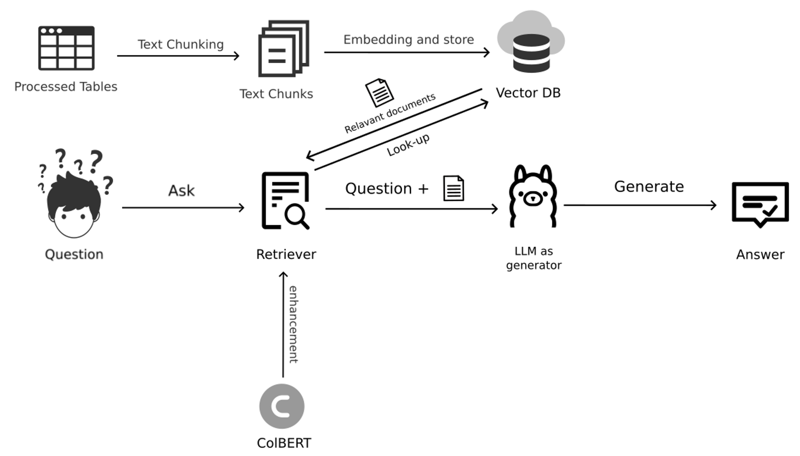
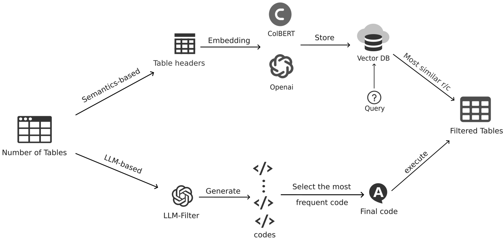
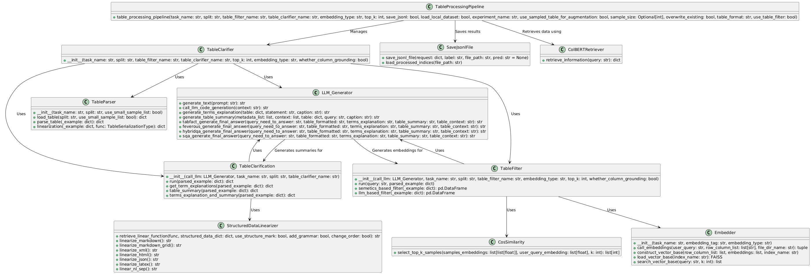

# **TableRAG**

## **Overview**

TableRAG is an advanced system designed for handling complex table-based question answering tasks. The system combines cutting-edge large language models (LLMs) with Retrieval-Augmented Generation (RAG) techniques, optimized specifically for multi-table environments. This project addresses the challenges posed by real-world scenarios, where users may need to query a set of related tables rather than a single one, by integrating advanced filtering, clarification, and retrieval mechanisms.

## **Table of Contents**

- [Background](#background)
- [System Architecture](#system-architecture)
  - [RAG-based Multi-Table QA System](#rag-based-multi-table-qa-system)
  - [Enhancement Mechanisms](#enhancement-mechanisms)
- [Datasets](#datasets)
- [Implementation Details](#implementation-details)
- [Installation](#installation)
- [Usage](#usage)
- [Pipeline Execution](#pipeline-execution)
- [Evaluation Experiments](#evaluation-experiments)
- [Acknowledgments](#acknowledgments)

## **Background**

Tables are a fundamental and widely used semi-structured data type, prevalent in relational databases, spreadsheet applications, and programming languages for data processing. They are utilized across various domains such as financial analysis, risk management, and healthcare analytics. Table Question Answering (TableQA) is a crucial downstream task that involves reasoning over table data to answer queries in natural language.

Recent advances in large language models (LLMs) have significantly improved the performance of TableQA. However, most existing studies focus on single-table scenarios. In real-world applications, users often encounter multiple related tables and may pose queries involving these tables. This project aims to address this gap by developing a system that can retrieve relevant tables from a large set and generate accurate answers.

## **System Architecture**

### **RAG-based Multi-Table QA System**

The core of our system is based on the Retrieval-Augmented Generation (RAG) approach, which combines retrieval mechanisms with generative models to enhance the accuracy of domain-specific QA tasks. The architecture consists of several key components:

1. **Table Processing and Text Segmentation**: Raw table data is preprocessed and segmented into multiple text fragments to facilitate efficient retrieval.
2. **Vector Database Construction**: The segmented text fragments are embedded and stored in a vector database, enabling rapid retrieval of relevant content.
3. **Query and Retrieval**: The system uses a ColBERT model to enhance retrieval precision by performing fine-grained token-level text encoding.
4. **Answer Generation**: Retrieved text fragments and the user's query are fed into an LLM, which generates the final answer in natural language.

  <!-- Image 1 -->

### **Enhancement Mechanisms**

To improve the accuracy and efficiency of multi-table QA, our system incorporates several enhancement mechanisms:

1. **Semantic-Based Table Filtering**: The system filters large tables based on semantic analysis to reduce noise and focus on relevant rows and columns. This filtering is done using both OpenAI's Embedding models and the ColBERT model.
2. **LLM-Based Filtering**: In addition to semantic filtering, an LLM is used to analyze the deep semantic relationship between the table content and the query, ensuring that only the most relevant table fragments are selected.
3. **Table Clarifier**: This module provides additional context for ambiguous or domain-specific terms in the table, improving the model's understanding and reducing biases.
4. **Table Summary Generation**: The system generates concise summaries of the table content, leveraging Wikipedia metadata and the table's context to enhance the LLM's comprehension.

  <!-- Image 2 -->

## **Datasets**

We evaluated our system using several well-known TableQA datasets:

- **TableFact**: A large-scale dataset focused on table fact verification tasks.
- **FEVEROUS**: A dataset designed for fact verification tasks combining structured table data with unstructured text data.
- **SQA**: Evaluates models in multi-step question-answering scenarios.
- **HybridQA**: A multi-modal dataset that includes both table and text data for testing complex reasoning steps.

## **Implementation Details**

### **Table Filtering**

We implemented two main types of filters:

1. **Semantic-Based Filtering**: Uses OpenAI's Embedding models and the ColBERT model to generate semantic embeddings for the table content and the query, selecting the most relevant rows and columns.
2. **LLM-Based Filtering**: Leverages an LLM to perform intelligent filtering based on deep semantic understanding, ensuring that only the most crucial information is retained.

  <!-- Image 3 -->

### **Table Clarifier**

To enhance the model's understanding of the table content:

1. **Term Clarification**: The system identifies and explains domain-specific terms and abbreviations using an LLM, ensuring accurate comprehension.
2. **Wiki-Based Summary Generation**: Metadata from Wikipedia is used to generate concise summaries of the table content, providing additional context for the LLM.

  <!-- Image 4 -->

### **Retrieval Process Enhancement**

We integrated ColBERT into the retrieval process, offering several advantages:

1. **Late Interaction Framework**: ColBERT allows for efficient pre-computation of document representations, reducing online query processing time.
2. **MaxSim Operation**: This operation evaluates the relevance of queries and documents by considering the maximum similarity between token embeddings.
3. **Rerank Mechanism**: After initial retrieval, a rerank mechanism is employed to refine the results, ensuring the highest relevance to the query.

### **Input Format Optimization**

Based on recent research, we optimized the format in which tables are fed into the LLM:

1. **HTML Format**: Preserves complex table structures, making it suitable for multi-dimensional or nested tables.
2. **Markdown Format**: Offers a simple, human-readable format that performs well in the Retrieval-Augmented Generation (RAG) paradigm.

### **Self-Consistency**

To further enhance the robustness and reliability of the generated outputs, we implemented a self-consistency mechanism:

- **Multiple Code Generations**: For each filtering and clarifying task, the system generates multiple code snippets or outputs.
- **Majority Voting**: The most frequently generated output is selected as the final result. This approach helps mitigate errors and inconsistencies that might arise from a single model run.

## **Installation**

To install and set up the TableRAG system, follow these steps:

### **1. Clone the Repository**

```bash
git clone https://github.com/yourusername/TableRAG.git
cd TableRAG
```
### **2. Set Up a Virtual Environment**

You can set up a virtual environment using either `conda` (Anaconda) or `venv` (Python's built-in tool).

#### **Linux and macOS:**

1. **Using venv**:

    1. **Create a Virtual Environment**:
       ```bash
       python -m venv venv
       source venv/bin/activate
       ```

    2. **Install Dependencies from `requirements.txt`**:
       ```bash
       pip install -r requirements.txt
       ```

#### **Windows:**

1. **Using venv**:

    1. **Create a Virtual Environment**:
       ```bash
       python -m venv venv
       venv\Scripts\activate
       ```

    2. **Install Dependencies from `requirements.txt`**:
       ```bash
       pip install -r requirements.txt
       ```

### **3. Set Up Environment Variables**

Configure any necessary API keys and environment variables as required. This may include API keys for OpenAI, if you are using their models for filtering or generation tasks.

### **4. Create `config.json` in the Root Directory**

After setting up the environment, create a `config.json` file in the root directory with the following structure:

```json
{
    "model": {
        "EMBEDDING_MODEL": "text-embedding-3-large",
        "GPT_MODEL": "gpt-4o-mini"
    },
    "api_key": "your-api-key-here",
    "api_base": "https://your-api-base-url-here",
    "batch_size": 1,
    "use_self_consistency": false
}
```

- **EMBEDDING_MODEL**: The model name for embedding generation.
- **GPT_MODEL**: The model name for GPT-based text generation.
- **api_key**: Your API key for accessing the models.
- **api_base**: The base URL for the API you are using.
- **batch_size**: Number of queries or requests processed in a single batch.
- **use_self_consistency**: Boolean flag to determine if the self-consistency mechanism should be used.

### **5. Version Information**

Ensure that your environment meets the following version requirements:

- **Python**: 3.10.14
- **PyTorch**: 2.3.1
- **Transformers**: 4.36.2
- **FAISS-gpu**: 1.7.2
- **LangChain**: 0.1.0
- **OpenAI**: 1.14.0
- **CUDA**: 12.1

## **Dataflow Diagram**
  <!-- Data Flow Diagram -->

## **Class Diagram**
  <!-- Class Diagram -->

## **Usage**

Once the system is

 installed, you can run the pipelines to process tables, retrieve relevant data, and generate answers to queries.

## **Pipeline Execution**

### **Table Processing Pipeline**

```bash
python -m src.processor.table_processor \
  --input_dir ./data/input \
  --output_dir ./data/output \
  --config ./config/table_processor.yaml
```

### **Retrieval Pipeline**

```bash
python -m src.retriever.retrieval \
  --input_dir ./data/output \
  --query "Your question here" \
  --output_dir ./data/retrieval_output \
  --config ./config/retriever.yaml
```

### **Generation and Evaluation**

```bash
python -m src.generator.generation \
  --input_dir ./data/retrieval_output \
  --output_dir ./data/final_output \
  --config ./config/generator.yaml
```

## **Evaluation Experiments**

### **Control Experiments**

We conducted extensive control experiments to validate the effectiveness of our enhancements. For each dataset, we compared the performance of the following system configurations:

1. **Baseline**: A standard RAG implementation without any enhancements.
2. **Enhanced System**: Our complete system with all proposed enhancements.

### **Ablation Experiments**

Ablation experiments were performed to assess the contribution of each component:

1. **Without Table Filtering**: Evaluates the system's performance without the table filtering module.
2. **Without LLM-Based Clarifier**: Measures the impact of removing the LLM-based clarifier.
3. **Without Retrieval Enhancement**: Tests the system's efficiency without the ColBERT integration.

```bash
python -m src.evaluation.evaluate \
  --input_dir ./data/final_output \
  --config ./config/evaluation.yaml
```

## **Acknowledgments**

I would like to express my sincere gratitude to the authors of the paper [“Tap4llm: Table provider on sampling, augmenting, and packing semi-structured data for large language model reasoning”](https://arxiv.org/abs/2312.09039) for providing valuable insights that influenced some of the ideas presented in this article. I have also borrowed some of the code from this paper for data loading and other tasks, as noted at the beginning of the relevant scripts.

I would also like to thank the developers of [RAGatouille](https://github.com/AnswerDotAI/RAGatouille), as the ColBERT implementation used in this project was built upon their work.

Additionally, I would like to thank PeiMa from the University of Leeds for her significant contributions to this project. Her expertise and support were instrumental in shaping the outcome of this work.